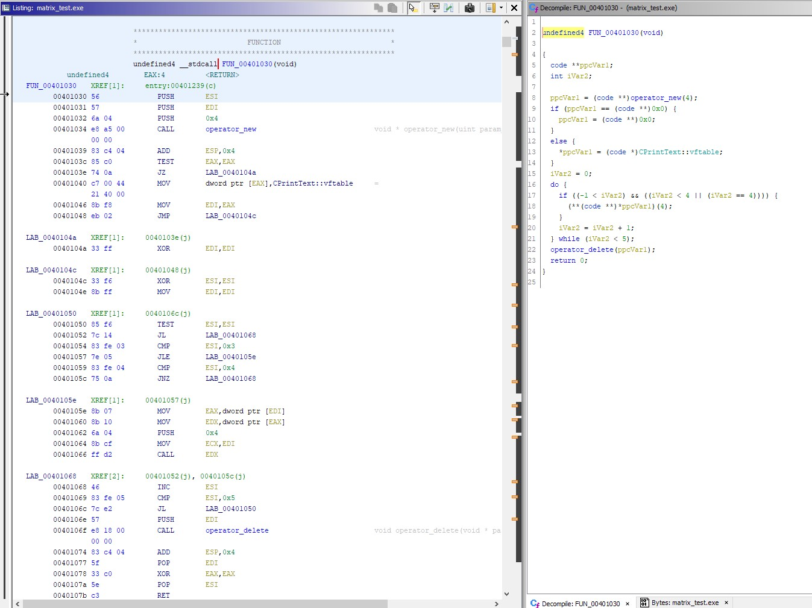
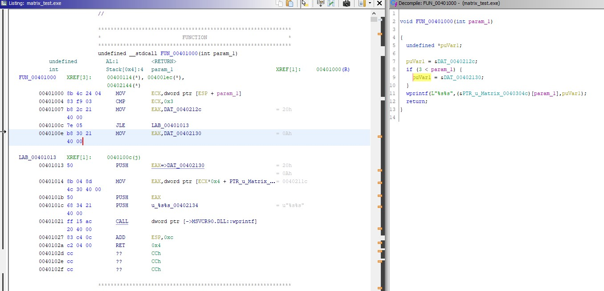
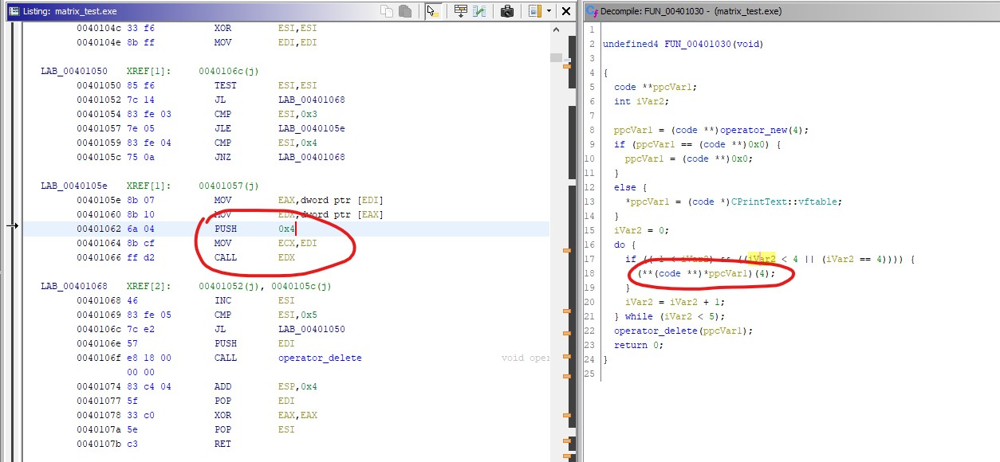
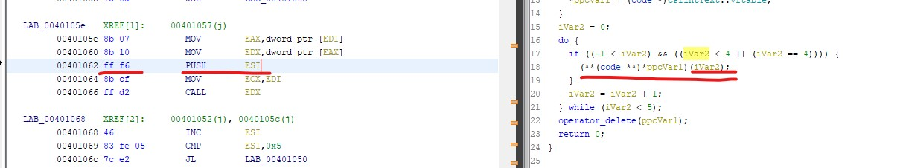
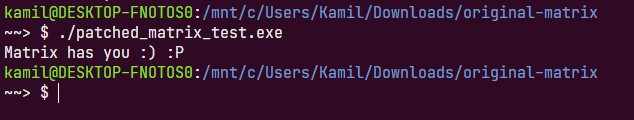

# patched matrix_test
## text of task 
> Simple RE task for job interview.
>
> You should patch the program to print words: 
> ["Matrix","has","you",":)",":P"], instead of ":P" sequence.
> Maximum patch size is 3 bytes.
> Use any type of disassembler, IDA is preferred.
---
## my solution

Скормим программу Ghidra 

Судя по результату дизассемблера и декомпилятора в программе есть:
- функция для отображения текста, принимающая в качестве параметра индекс массива;
- главная фукнция, которая в цикле вызывает функцию отображения текста, передавая ей индекс необходимого элемента.

Массив состоит из следующих элементов ["Matrix","has","you",":)",":P"]

__Цель__ - добиться использования счетчика вместо конретного значения, чтобы пройти по всему массиву и отобразить весь текст 

Вместо значения `4` поместим в стек значение счетчика `ESI`

Теперь программа проходится по всему массиву строк

